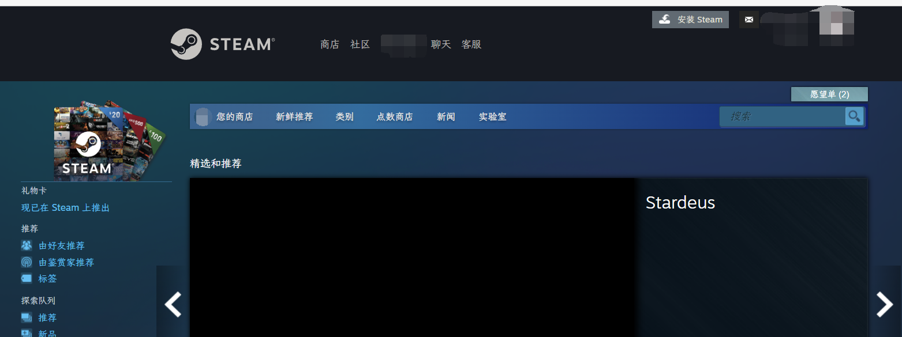
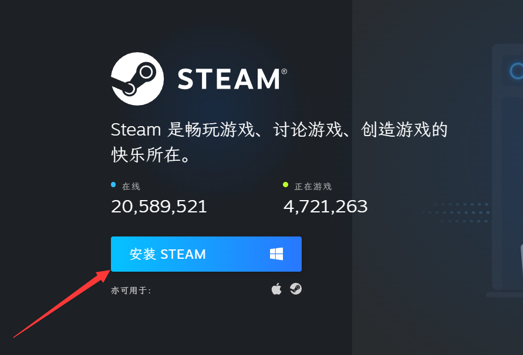
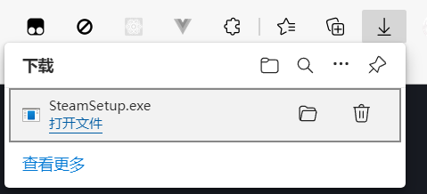
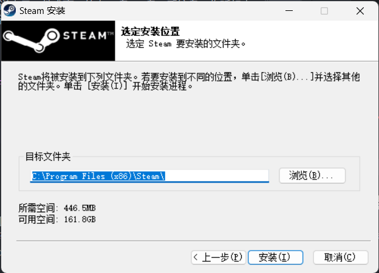

# 写给电脑白痴的 steam 使用教程

你，一个电脑白痴，对电脑只知道 word，ppt，excel。
而现在你的朋友邀请你一起玩一个 steam 上的游戏，你完全不知道该怎么做，这需要一些技巧，但也是在互联网行走的基本能力。
本篇教程将会手把手教你如何下载并使用 steam。

## 找到 steam 官方网站

你可以直接点击这个链接，https://store.steampowered.com/。
但我想你也应该有如何直接从搜索引擎找到目标的能力，基本的方法是识别域名，就是上边的链接，他是正常的单词，而且你要搜索的是 steam，store.steampowered.com 包含 steam 这个单词，他大概率是你需要寻找的网站而其他的就不是。

> www.53xt.com 什么奇怪的网站

> steampowered.com 这就对了

也许很不幸，你在尝试访问 steam 网站时浏览器显示无法访问此页面，你可能需要*科学上网*来进行这一步。

## 下载 steam

点击 `安装 Steam` 下载客户端

## 安装 steam

很不幸，安装对你来说也是一件难事，什么 C盘、D盘、系统盘、你听起来都是一脸懵逼，他们说软件不要装到 C盘里，你对此也完全没有概念。

### 从下载中打开

### 安装位置

打开后一直选择下一步，到让你选择安装位置。

默认的安装位置一直会是在系统盘，这里你可以点击浏览选择另一个盘进行安装，安装的盘通常来说并没有影响，不会说某个程序只能装哪个盘。通常考虑一下几个问题。

- 你的系统盘（C盘）是否已经变红（容量不足），此时你应该考虑换一个盘安装。
- 我的电脑中显示的两个盘是否是两个不同的物理盘，比如说一个是固态硬盘，一个是机械硬盘。这个时候选择不同的盘，在之后打开的时候就会因为盘的不同而加载速度不同。

我个人是没有分区的，只有C盘，所以就在默认位置安装了。

## 下载游戏

steam 上点一点就好了，应该不需要教吧...

## 加速器

你需要加速器大多是因为这样的情况，你想要加 steam 好友，但无法访问 steam 社区。你想要玩 steam 上的多人在线游戏，但却总是连接不上服务器。这时，你就需要加速器。

> 加速器是这样发挥作用的，为你提供服务的服务器只在国外运行，但因为 GFW 的存在，你并不能很好的访问外网。这时，加速器让你的电脑连接到一台中间服务器，而中间服务器可以很好的访问外网，这是你就可以借由中间服务器访问外网了。

常用的加速器有

- [网易uu](https://uu.163.com/)
- [雷神](https://www.leigod.com/)
- [迅游](https://www.xunyou.com/)
